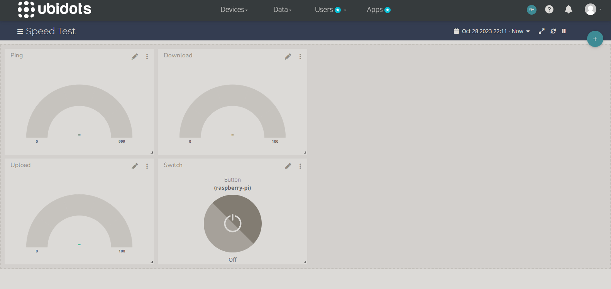
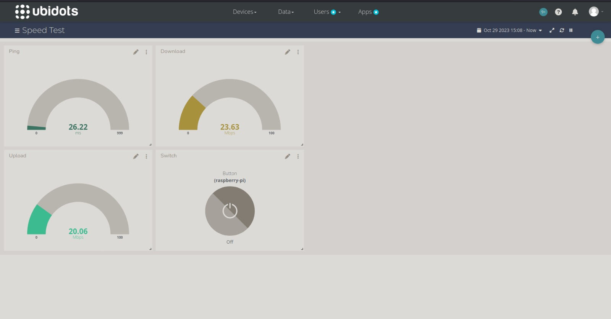

## 1. Introdução

Com o objetivo de utilizar o Raspberry Pi, foi desenvolvido um software para medir a velocidade da internet conectada ao Raspberry e projetar os valores obtidos no dashboard do Ubidots. Foi também criado um botão switch no dashboard para fazer a inicialização da medição de velocidade no Raspberry.

## 2. Dependências

Este projeto depende das seguintes bibliotecas:

- Python >= 3.5
- requests
- speedtest-cli

## 3. Como rodar

### 3.1 Instalar dependências

``` 
pip3 install speedtest-cli requests
```
### 3.2 Ubidots

- Crie uma conta no Ubidots.
- Crie um dashboard que tenha indicadores para Download, Upload e Ping.
- Pegue o token gerado para a sua conta e substitua na URL dentro do código ```speed-test.py```
### 3.3 Rodar o script

Rode o script que está na pasta ```/src```  com: ```python3 scr/speed-test.py```

## 4. Demostração do projeto

### 4.1 Fotos






### 4.2 Vídeo

https://youtu.be/_QF-7n6ZhTI

## 5. Integrantes

- Ubirantan da Motta Filho R.A 20.00928.3
- João Paulo M Socio R.A 20.00704-3
- Luan Teixeira R.A 20.01681-6
- Bruno Davidovitch Bertanha R.A 20.01521-6